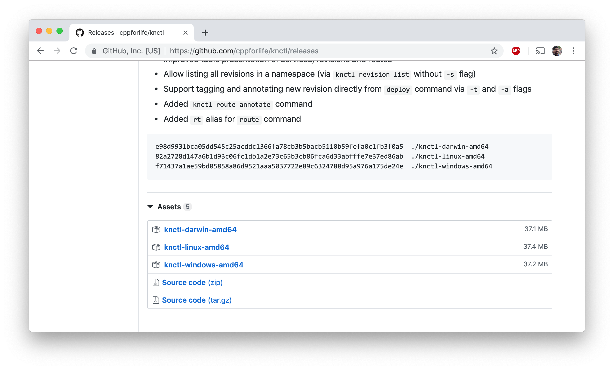

# Step 4: Install and Enable Knative

## Install \`knctl\` CLI

Download the appropriate binary from the [releases section](https://github.com/cppforlife/knctl/releases) of the `knctl` project \(and optionally add it to your PATH\), similar to the steps you followed earlier in [Step 1](step1.md#download-the-kubernetes-cli).



After installing, verify you can access it in your terminal:

```text
$ knctl version
Client Version: 0.1.0
Succeeded
```

## Enable Knative \(and Istio\)

To enable Knative, let's use the [IBM Cloud Dashboard](https://cloud.ibm.com/). Next, make sure you have the right account chosen. In the top right of the webpage, open the drop-down and choose the IBM account.


Next, navigate to the Kubernetes dashboard by pressing the hamburger button on the top-left and choosing Kubernetes. You should see your cluster in the list, click it.

Navigate to the `Addons` tab and install Knative \(which comes with Istio\):


The install process may take a minute or two. To know when it's done you can run two commands - first see if the Istio and Knative namespaces are there:

```text
kubectl get namespace
```

and you should see something like:

```text
NAME                 STATUS   AGE
default              Active   7d18h
ibm-cert-store       Active   7d18h
ibm-system           Active   7d18h
istio-system         Active   7d17h
knative-build        Active   7d17h
knative-eventing     Active   7d17h
knative-monitoring   Active   7d17h
knative-serving      Active   7d17h
knative-sources      Active   7d17h
kube-public          Active   7d18h
kube-system          Active   7d18h
```

Notice the `istio-system` namespace, and the `knative-...` namespaces.

Once the namespaces are there, check to see if all of the Istio and Knative pods are running correctly:

```text
kubectl get pods --namespace istio-system
kubectl get pods --namespace knative-serving
kubectl get pods --namespace knative-build
```

You could check the pods in all of the Knative namespaces, but for this workshop only "serving" and "build" are required.

Example Output:

```text
NAME                          READY   STATUS    RESTARTS   AGE
activator-df78cb6f9-jpvs7     2/2     Running   0          38s
activator-df78cb6f9-nhzhf     2/2     Running   0          37s
activator-df78cb6f9-qjg8w     2/2     Running   0          37s
autoscaler-6fccb66768-m4f2q   2/2     Running   0          37s
controller-56cf5965f5-8pwcg   1/1     Running   0          35s
webhook-5dcbf967cd-lxzmk      1/1     Running   0          35s
```

If all of the pods shown are in a `Running` or `Completed` state then you should be all set. If not, wait a couple of minutes until all the pods are `Running` or `Completed`.

